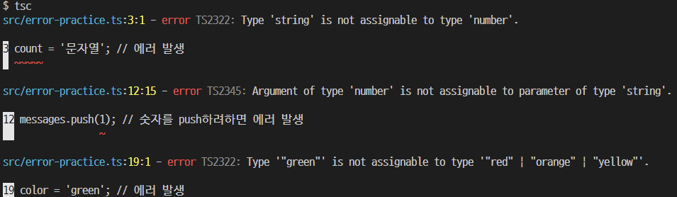

# Typescript day1

## typescript를 사용하는 이유

- IDE 를 더욱 더 적극적으로 활용 (자동완성, 타입확인)
    > TypeScript 를 사용하면 자동완성이 굉장히 잘됩니다. 함수를 사용 할 때 해당 함수가 어떤 파라미터를 필요로 하는지, 그리고 어떤 값을 반환하는지 코드를 따로 열어보지 않아도 알 수 있습니다. 추가적으로, 리액트 컴포넌트의 경우 해당 컴포넌트를 사용하게 될 때 props 에는 무엇을 전달해줘야하는지, JSX 를 작성하는 과정에서 바로 알 수 있으며, 컴포넌트 내부에서도 자신의 props 에 어떤 값이 있으며, state 에 어떤 값이 있는지 알 수 있습니다. 또한, 리덕스와 함께 사용하게 될 때에도 스토어 안에 어떤 상태가 들어있는지 바로 조회가 가능해서 굉장히 편리합니다.

<br>

- 실수방지
    > 함수, 컴포넌트 등의 타입 추론이 되다보니, 만약에 우리가 사소한 오타를 만들면 코드를 실행하지 않더라도 IDE 상에서 바로 알 수 있게 됩니다. 그리고, 예를 들어 null 이나 undefined 일 수도 있는 값의 내부 값 혹은 함수를 호출한다면 (예: 배열의 내장함수) 사전에 null 체킹을 하지 않으면 오류를 띄우므로 null 체킹도 확실하게 할 수 있게 됩니다.

<br> <hr>

## 객체와 타입

### 변수 선언문

- 타입 주석

    ```
    const message: string = 'hello world';
    console.log(message);
    ```
    message 값이 선언된 코드에서 `: string` 이라는 코드는 해당 상수 값이 문자열 이라는 것을 명시한다. string 뿐만 아니라 숫자는 number, 불리언은 boolean, object, undefined, null 등을 지정 해 줄 수 있다. 이를 `타입 주석(type annotation)`이라고 한다.

    > let a = any; <br>
     // 어떤 종류의 타입의 값도 저장 가능

<br>

- 타입 추론

    typescript는 javascript와의 호환을 위해 타입 주석 부분을 생략할 수 있다. tsc는 다음과 같은 코드를 만나면 대입 연산자 = 오른쪽 값에 따라 변수의 타입을 지정한다.

    ```
    let n = 1;  // n의 타입을 number로 판단
    let b = true;   // b의 타입을 boolean으로 판단
    let s = 'hello' // s의 타입을 string으로 판단
    let o = {}  // o의 타입을 object로 판단
    ```
    이를 `타입 추론(type inference)`이라고 한다.

<br>

- 에러 예시

    ```
    let count = 0; // 숫자
    count += 1;
    count = '문자열'; // 에러 발생

    const message: string = 'hello world'; // 문자열

    const done: boolean = true; // 불리언 값

    const numbers: number[] = [1, 2, 3]; // 숫자 배열
    const messages: string[] = ['hello', 'world']; // 문자열 배열

    messages.push(1); // 숫자를 push하려하면 에러 발생

    let mightBeUndefined: string | undefined = undefined; // string 일수도 있고 undefined 일수도 있음
    let nullableNumber: number | null = null; // number 일수도 있고 null 일수도 있음

    let color: 'red' | 'orange' | 'yellow' = 'red'; // red, orange, yellow 중 하나임
    color = 'yellow';
    color = 'green'; // 에러 발생
    ```

    에러 메세지
    

<br>

### 객체와 인터페이스

- 객체와 인터페이스

    object 타입은 인터페이스와 클래스의 상위 타입이다. object 타입으로 선언된 변수는 number, boolean, string 타입의 값을 가질 수는 없지만, 속성 이름이 다른 객체를 모두 자유롭게 담을 수 있다.


    ```
    let o: object = {name: 'Jack', age: 32}
    o = {first: 1, second: 2}

    console.log(o); // { first: 1, second: 2 }
    ```
    
    <br> 

    위의 코드에서 object는 마치 객체를 대상으로 하는 any 타입처럼 동작한다. 인터페이스 구문은 이렇게 동작하지 않게 하려는 목적으로 고안되었다. 즉, 변수 o에는 항상 name과 age 속성으로만 구성된 객체만 가질 수 있게한다.

    ```
    interface IPerson {
        name: string
        age: number
    }
    ```

    IPerson 인터페이스의 목적은 name과 age라는 이름의 속성이 둘다 있는 객체만 유효하도록 객체의 타입 범위를 좁히는 데 있다.

    ```
    interface IPerson {
        name: string
        age: number
    }
    let good: IPerson = {name: 'Jack', age: 32}

    let bad1: IPerson = {name: 'Jane'}  // age 속성이 없으므로 오류
    let bad2: IPerson = {age: 22}   // name 속성이 없으므로 오류
    let bad3: IPerson = {}  // name, age 속성이 없으므로 오류
    let bad4: IPerson = {name: 'Tim', age:26, etc: trhe}    // etc 속성이 있어서 오류
    ```

    > 선택 속성 구문 <br>
    인터페이스를 설계할 때 어떤 속성은 반드시 있어야 하지만, 어떤 속성은 없어도 되는 형태로 만들고 싶을 때 속성 이름 뒤에 물음표 기호를 붙여서 만든다.

    ```
    interface IPerson {
        name: string
        age: number
        etc?: boolean
    }
    let good1: IPerson = {name: 'Jack', age: 32}
    let good2: IPerson = {name: 'Jane', age: 27, etc: true}
    ```
    
    etc는 선택 속성이므로 5행 6행은 모두 정상 동작한다.
